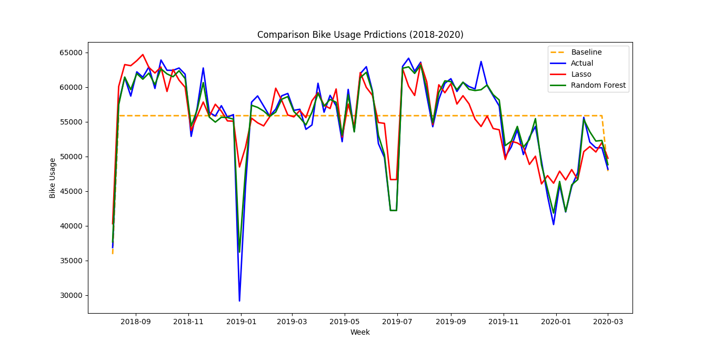
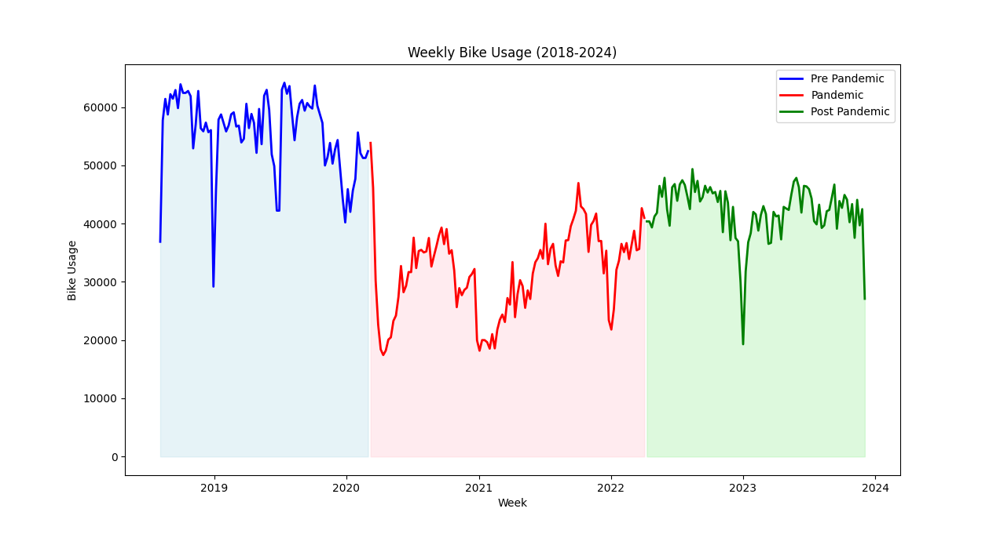
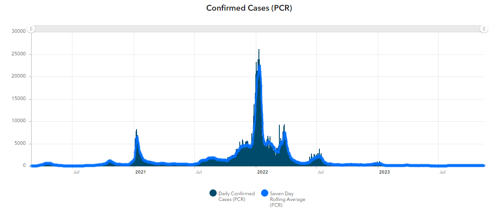
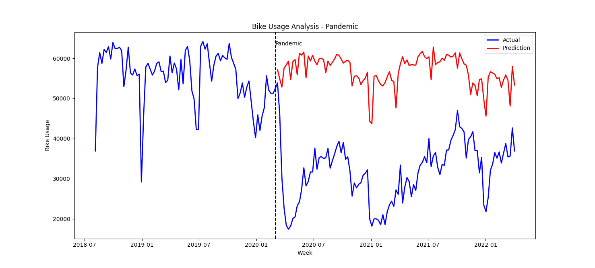
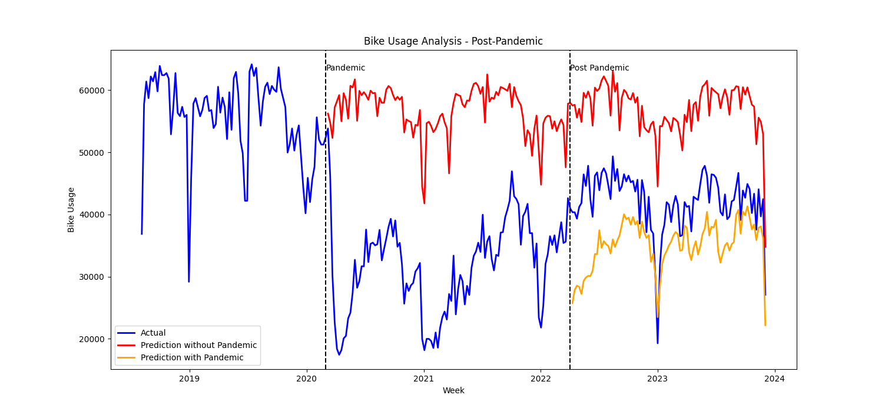

# Dublin Bikes Pre/Post Pandemic
This project was my final submission for **CS7CS4 - Machine Learning** course at **Trinity College Dublin**.
I was tasked to analyze the impact of pandemic on Dublin Bikes and how the usage changed during post-pandemic period.

## Table of Contents
1. [DATA PREPROCESSING AND FEATURE ENGINEERING](#DATA-PREPROCESSING-AND-FEATURE-ENGINEERING)
2. [MACHINE LEARNING METHODOLOGY](#MACHINE-LEARNING-METHODOLOGY)
3. [EVALUATION WITH DESCRIPTIVE STATISTICS](#EVALUATION-WITH-DESCRIPTIVE-STATISTICS)
4. [EVALUATION WITH PREDICTION MODEL](#EVALUATION-WITH-PREDICTION-MODEL)
5. [RUNNING CODE](#RUNNING-CODE)

## DATA PREPROCESSING AND FEATURE ENGINEERING

### Dataset Overview

The dataset is represented using following features. There are separate time-series datapoints for different stations.

***Table 1: Features in Dublin Bikes Dataset***
| Label | Type | Description |
| --- | --- | --- |
| STATION ID | numeric | Globally unique identifier of station |
| TIME | timestamp | Time of fetching the data |
| LAST UPDATED | timestamp | Time of last updated information |
| NAME | text | Station name |
| BIKE STANDS | numeric | Station total number of bikes stands |
| AVAILABLE BIKE STANDS | numeric | Station available bike stands |
| AVAILABLE BIKES | numeric | Station available bikes
| STATUS | text | Station status (Open/Close) |
| ADDRESS | text | Station address |
| LATITUDE | numeric | Station latitude |
| LONGITUDE | numeric | Station longitude |

Following things had to be considered when preparing the dataset for ML algorithm:
- **Multiple files**: The dataset from 2018 to 2021 is divided into quarterly files while the dataset from 2022 onwards is divided into monthly files.
- **Different sampling rates:** The samples for all stations in quarterly files are every 5 minutes while 30 minutes in case of monthly files.
- **High sampling rate:** The size of the dataset is very large due to frequent data samples.
- **Different labels:** Some feature labels in monthly samples have “_” in them instead of “ “.
- **Unnecessary labels:** Some labels are not required for predictions and need to be removed.
- **Deriving secondary features:** We need to derive a USAGE and multiple TIME metrics from existing features.
- **Adding complementary features:** The given features might not be enough to completely describe usage patterns and we need to augment using other datasets.

### PREPARING DATASET
Keeping above points in mind, following changes were implemented.

#### Deriving USAGE features
- The bike usage was defined as the number of bikes coming in and going out of a station. This is represented as **USAGE**.
- This was derived from **AVAILABLE BIKE STANDS** feature as a absolute difference between adjacent samples. Therefore, this represents how many bikes entered/exited the station during the time sample.
- The USAGE column was selected as the output feature.

#### Merging all dataset files
- The quarterly samples were down sampled by taking the first and last entries for every hour. This makes sure both quarterly and monthly sample rates are the same (every 30 mins).
- The features labels for monthly samples were modified to keep similar to quarterly labels.
- The datapoints from all files were combined into a single dataset.

#### Reducing the dataset size
- The data points were down sampled to hourly to reduce size.
- The **USAGE** metric for a given hour sample was aggregated from all Stations. Thus, USAGE metric now represents bikes coming in/out across all stations.
- This finally generated a dataset which focuses on overall city-wide bike usage patterns.

#### Splitting TIME feature
The TIME feature was split into **HOUR**, **DAY**, **MONTH**, **YEAR** and **WEEKDAY**.

#### Augmenting with weather data
- The past 30-year weather dataset for Dublin was downloaded from official **Met Éireann** source: https://data.gov.ie/dataset/dublin-airport-hourly-data
- This dataset included hourly samples and covers the entire duration of our Dublin Bikes dataset.
- Both datasets were merged.

#### Augmenting with holiday data
- The past government holidays were scraped from online sources and implemented as one-hot encoded feature **PUBLIC HOLIDAY**.
- Similarly, all weekends were also tracked as one-hot encoded feature **WEEKEND**.

After combining all datasets and required processing we get following features to work with. The **Pearson’s Correlation Coefficient (PCC)** is also provided to assess the linear correlation between input features with output feature **USAGE**.

***Table 2: Selected Features***
| Time | PCC - USAGE |
| --- | --- |
| HOUR | 0.317587 |
| DAY | -0.01059 |
| MONTH | 0.048836 |
| YEAR | -0.14597 |
| WEEKDAY | -0.16311 |
| WEEKEND | -0.21757 |
| PUBLIC HOLIDAY | -0.08669 |
| rain | -0.05172 |
| temp | 0.229729 |
| wetb | 0.178676 |
| rhum | -0.28195 |
| wdsp | 0.09488 |
| sun | 0.287155 |
| vis | 0.197947 |
| clht | -0.04432 |
| clamt | 0.039875 |

<u>**By analyzing the selected features using PCC, we can establish that there USAGE feature has a strong linear correlation with HOUR, WEEKEND, TEMP (Temperature), RHUM (Humidity), SUN (Sunlight) and VIS (Visibility).**</u>

## MACHINE LEARNING METHODOLOGY
As for selecting ML method, it was decided to go with two models and analyze their performance.
- **Lasso regression:** To model linear relationships within data. It also is fast to compute and provides a good idea about which features are important.
- **Random Forest:** This model was used to map non-linear relationships within data. It is generally known to be perform good with time series data.

### BASELINE MODEL
We use the average usage for the duration as our baseline. This means that the model will always predict the average bike usage. Both Lasso and Random Forest regression models need to perform better than the MSE and MAE of this model.

### LASSO REGRESSION
Lasso regression has good ability to model linear relationships and provides us a parameter alpha for L1 regularization.

#### Cross Validation
- The period between **AUG 2018** and **MAR 2020** was used as the dataset for analysis as this period is not impacted due to Pandemic.
- We cannot directly use K-fold Cross Validation to determine optimal value of alpha since it is not possible to shuffle and then split data due to its time-series nature.
- Instead, we split data into consecutive train-test folds. This ensures each test starts where the previous one ended.
- Finally, Alpha values that are tested are: **[0.01, 0.1, 0.15, 0.5, 0.75, 1.0, 2, 5, 10.0]**
- This range is chosen has MSE starts to increase beyond the bounds of this range. For smaller values of Alpha the model was overfitting while for higher values it was underfitting.

***Table 3: Alpha values and MSE for Lasso***
| Alpha | MSE (Mean) | MSE (STD) |
| --- | --- | --- |
| 10 | 51553.245 | 6427.7685 |
| 5 | 49648.867 | 6017.3773 |
| 2 | 48159.343 | 6162.0479 |
| 1 | 47815.842 | 6241.9003 |
| 0.75 | 47767.276 | 6296.3249 |
| 0.5 | 47743.213 | 6359.1891 |
| 0.15 | 47936.521 | 7078.7253 |
| 0.1 | 48085.455 | 7323.9638 |
| 0.01 | 48794.368 | 8242.9959 |

### RANDOM FOREST
Random forest algorithm is a type of ensemble machine learning algorithm which works by creating multiple Decision Trees and takes the Mean of the leaf or end nodes of the trees. These values represent possible predictions for the output parameter. Each decision tree is based on subsets of features and training data.

- Decision trees due to tree nature help model relationships between the input parameters and out well. They can model both linear and non-linear relationships.
- Random Forest can handle large number of input parameters and can manage outliers and missing data points.
- Due to construction of multiple trees, the model is robust against overfitting.

#### Cross Validation
- We cannot directly use K-fold Cross Validation to determine optimal value of alpha since it is not possible to shuffle and then split data due to its time-series nature.
- Instead, we split data into consecutive train-test folds. This ensures each test starts where the previous one ended.
- Three hyperparameters were considered for cross-validation:
  - **Max depth:** The maximum depth of each decision tree. Higher numbers capture more relationships between parameters but can lead to overfitting. Similarly, small values generalize better but can underfit by missing key relationships.
  - **Minimum samples split:** It means minimum number of samples required before a node in split in the decision tree. Higher values are used as a regularization method but can lead to underfitting. Lower values make the trees split easily can capture more relationships, but can lead to overfitting.
  - **Number of estimators:** It refers to number of trees in the forest. Higher values provide a robust model with less chances of overfitting.
 - Since there are multiple hyperparameters to be considered, Grid search was performed by considering all combinations of hyperparameter values.
 - The values used are given in Table 4.

***Table 4: Hyperparams for Random Forest***
| Hyperparameter | Values |
| --- | --- |
| Max depth | [10, 5, 100] |
| Minimum Samples Split | [2, 5, 10] |
| Number of estimators | [5, 10, 20] |

Some combinations from grid search are show in Table 5, it is evident that best combination to be used is **Max depth = 50, Minimum Samples Split = 10 and Number of estimators = 20** as it has minimum MSE values.

***Table 5: Grid Search for selecting Random Forest hyper parameters.***
| Max depth | Min samples split | N estimators | MSE (Mean) | MSE (STD) |
| --- | --- | --- | --- | --- |
| 10 | 2 | 5 | 11164.81 | 7302.67 |
| 10 | 10 | 10 | 11206.09 | 7087.27 |
| 50 | 2 | 5 | 11458.25 | 6800.54 |
| 50 | 10 | 20 | 10060.04 | 6061.53 |
| 100 | 2 | 5 | 11240.83 | 7147.03 |
| 100 | 10 | 20 | 10282.9 | 6280.8 |

<u>**By referring to Table 6, we can observe that the features which have high linear and non-linear correlation with Bike Usage are: HOUR and WEEKEND.**</u>

***Table 6: Feature Importance for RF***
| Feature | Importance |
| --- | --- |
| HOUR | 0.693199 |
| DAY | 0.012005 |
| MONTH | 0.051505 |
| YEAR | 0.002355 |
| WEEKDAY | 0.012884 |
| WEEKEND | 0.146251 |
| PUBLIC | 0.021859 |
| rain | 0.006531 |
| temp | 0.015067 |
| wetb | 0.008006 |
| rhum | 0.011403 |
| wdsp | 0.004586 |
| sun | 0.002678 |
| vis | 0.00427 |
| clht | 0.005347 |
| clamt | 0.002053 |

### WHICH MODEL TO CHOOSE
Both models were used to predict values during the pre-pandemic period and Mean Square Error and Mean Absolute Error values were computed for comparison. The predicted values for both models along with actual values are show in Figure 1. The MSE and MAE values are given in Table 7.

**Figure 1:**

From Figure 1, we can see visually that predictions using Lasso regression deviate a lot from actual values, whereas predictions by Random Forest model are much closer. Both the models fit the trend plot better than the baseline model.

***Table 7: Prediction error values for models.***
| Model | MSE | MAE |
| --- | --- | --- |
| Baseline | 64992.66 | 184.91 |
| Lasso Regression | 48281.41  | 154.17 |
| Random Forest |1933.15 | 21.53 |

From Table 7, both models have lower MSE and MAE values than the baseline model. It is clear that Random Forest algorithm performs much better than Lasso Linear regression models. This can be attributed to following reasons:
- Lasso regression only captures linear relationships between output feature and input features.
- Random Forest model is able to capture non-linear relationships between output feature and input features.
- Random Forest model also captures complex relationships between input parameters since it utilizes decision trees.

<u>**Therefore, we will proceed with Random Forest model for analyzing Bike usage Trends during and after Pandemic period.**</u>

## EVALUATION WITH DESCRIPTIVE STATISTICS
**Figure 2:**

**Figure 3:**

The Bike usage dataset is converted from hourly to weekly samples and plotted in Figure 2. The dataset is divided into following periods:

| Period | Start | End |
| --- | --- | --- |
| Pre-Pandemic | 01-08-2018 | 01-03-2020 |
| Pandemic | 01-03-2020 | 03-04-2022 |
| Post-Pandemic | 03-04-2022 | 31-12-2023 |

 - The pandemic started in March 2020 when first wave struck Dublin County.
 - The cases followed started to decline with minimal surges after April 2022 and will be considered post pandemic period.

These periods were identified based on:
 - Irish News Articles.
 - Dublin County Daily cases statistics in Figure 3.
 - Ireland Covid timeline as per Wikipedia.

 ### ANALYSIS
- **Pre-Pandemic Period**
  - Represented as blue region, the usage is very high with dips around new year.
- **Pandemic Period**
  - Represented as red region, the bike usage is almost half compared to pre-Pandemic period.
  - There is large dip in March 2020 when the first wave hit Dublin and lockdowns were imposed.
  - Other dips in Bike Usage in Figure 2 – October 2020, January 2021, August 2021, January 2022 all correlate with Daily cases peaks during same period in Figure 3.
- **Post-Pandemic Period**
  - Represented as Green region, the bike usage is much higher compared to during Pandemic period.
  - There are fewer dips as no lockdowns were announced during this period.
  - The average and maximum usage is still lower than pre-pandemic levels.

## EVALUATION WITH PREDICTION MODEL
### PANDEMIC PERIOD

**Figure 4:**

The Random Forest Regression model is trained with Pre-Pandemic dataset and is then used to predict Bike usage during Pandemic period. Both predicted and actual bike usages are plotted in Figure 4. This figure includes both Pre-Pandemic and Pandemic periods.
- Visually, the actual usage (blue) deviates significantly from predicted usage (red).
- Both plots still exhibit the year-end dips due to holiday season, but overall graph during pandemic period is shifted much below.
- The Mean Square Error (MSE) and Mean Absolute Error (MAE) during pandemic period are 679728032.90 and 25104.07 respectively.
- The errors are significantly higher when compared to errors during Pre-Pandemic period as highlighted in Table 7 (1933.15 and 21.53).
- We can conclude that **pandemic had an extremely negative effect on City Bike usage.**

### POST-PANDEMIC PERIOD

**Figure 5:**

The Random Forest Regression model is trained with both Pre-Pandemic and Pandemic dataset and is then used to predict Bike usage during Post-Pandemic period. The predictions along with predictions for this period based on model in previous section are plotted in Figure 5. This figure included Pre-Pandemic, Pandemic and Post-Pandemic periods.
- Visually, the actual usage (blue) deviates from the prediction with pandemic (yellow). 
- The actual usage is about half of the prediction without pandemic (red).
- The Mean Square Error (MSE) and Mean Absolute Error (MAE) for predictions with pandemic during post-pandemic period are 66080956.44 and 7200.82 respectively. These values are lower than previous section.
- First conclusion is that **bike usage has recovered significantly from Pandemic levels.**
- Seconds conclusion is that **bike usage has still not reached Pre-Pandemic levels.**

## RUNNING CODE
### Downloading dataset
**Dublin Bikes Dataset:** https://data.gov.ie/dataset/dublinbikes-api
  - Download and save in dataset_org directory
**Weather:** https://data.gov.ie/dataset/dublin-airport-hourly-data
  - Manually remove data points before the starting data, this saves time to load CSV file.
  - Save in dataset_org directory
**Public Holiday:** Google and modify prep_data.py

### File Specific Information
1. PRE-PROCESSING DATA:
    prep_data.py

2. DRAW COMPLETE DATA
    plot_complete.py

3. CV RF and LASSO:
    model_lasso_cv.py
    model_rf_cv.py

4. MODEL COMPARISON
    model_comparison.py

5. ANALYSIS
    analysis_pandemic.py
    analysis_post_pandemic.py
